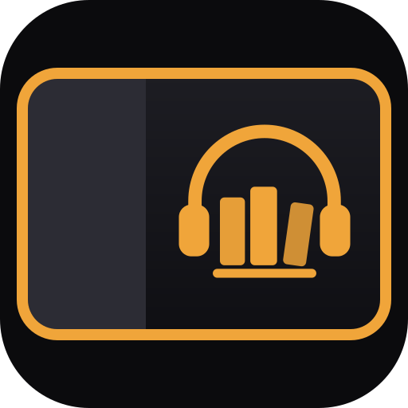

<p align="center">
  
</p>

<h1 align="center">ABS Car</h1>

<p align="center"><em>Audiobookshelf for my Car</em></p>

> **Requirement:** you need your own [Audiobookshelf](https://www.audiobookshelf.org) server.
> ABS Car is only a client/player: your books, progress and account live on your
> Audiobookshelf server. Without it, this app can't be used. This is an **unofficial** client,
> not affiliated with the Audiobookshelf project.

An Audiobookshelf audiobook player with big, touch-friendly buttons, designed for the web
browser built into your car's touchscreen and served at `https://audiobookshelf.example.com/car`.
The car is paired with a short code from your phone, so you never type passwords or keys on the
car's screen.

## Made for in-car browsers

ABS Car is a self-hosted web app built for the large touchscreens and built-in web browsers found
in many modern cars, such as those in **Tesla** and **BYD** vehicles. Nothing to install in the
car: open the URL, pair it once with your phone and listen to your Audiobookshelf audiobooks
while you drive.

- **Large tap targets** that are easy to hit on a car screen, with no tiny menus.
- **Landscape layouts** for wide dashboard screens, plus a narrower layout for smaller displays.
- **Light, dark or automatic theme**, so the screen isn't blinding at night.
- **Pick up where you left off**: progress syncs with your Audiobookshelf server, so you can
  switch between the car, your phone and the web.
- **Steering wheel and media controls** where the car's browser supports them (Media Session).

It works in any modern web browser, so you can also use it on tablets, phones and desktops.

> Tesla and BYD are trademarks of their respective owners. They are mentioned only to describe
> compatibility. ABS Car is not affiliated with, endorsed by or sponsored by Tesla, BYD or any
> other car maker.

## Features

- **Pairing by code or QR** from your phone; the car only gets a long-lived cookie.
- **Player** with large controls, chapter progress with the chapter name inside the bar,
  whole-book progress, chapter list, playback speed presets and slider, and one-tap bookmarks.
- **Library** with search (title and author), infinite scroll, and **Series**, **Authors** and
  **Narrators** views.
- **Progress sync** with Audiobookshelf, offline-tolerant, with a configurable warning after
  repeated sync failures.
- **Light / dark / auto theme**, **English, Spanish and French**, and an app icon for bookmarks
  and home screens.

## How it works

```
Car ──cookie──▶ abs-car (/car) ──token──▶ Audiobookshelf
                   │
Phone ──code + username/password──▶ /car/pair
```

- The car shows a 4-character code and a QR code that expire after 10 minutes.
- On your phone, open `/car/pair` (or scan the QR) and sign in with your Audiobookshelf account.
- The server stores the Audiobookshelf session token (never the password) and refreshes it
  automatically. The car only receives a cookie valid for one year.
- All API calls and audio go through the built-in proxy, which only allows what the app needs.
- To unpair: ⚙️ Settings → "Unlink this car". You can also remove the car from
  `abs-car-data/store.json` and restart the container.

## Deployment

ABS Car runs as a single Docker container next to your Audiobookshelf server, behind the same
reverse proxy and domain, on the `/car` path.

1. Clone the repository on your server and create your `.env` from the template
   (`.env` is not committed):
   ```bash
   git clone https://github.com/crazystress/abs-car.git && cd abs-car
   cp .env.example .env   # set your domain in ABS_DOMAIN
   ```
2. Review the values marked with `<-- AJUSTA` in `docker-compose.yml`:
   - `ABS_URL`: the **internal** address of your Audiobookshelf container (usually port 80),
     e.g. `http://audiobookshelf:80` or `http://<audiobookshelf-ip>`.
   - The network shared with Traefik and Audiobookshelf.
   - Your Traefik HTTPS `entrypoint` and `certresolver` (copy them from your Audiobookshelf router).
3. Start it:
   ```bash
   docker compose up -d --build abs-car
   ```
4. Check `https://audiobookshelf.example.com/car/healthz` → `{"ok":true}`.
5. Open `https://audiobookshelf.example.com/car` in the car and pair it with your phone.

The `Host(...) && PathPrefix(/car)` router has priority 100, so it only takes over `/car`;
the rest of your Audiobookshelf site keeps working as before.

### Traefik with dynamic configuration files

If your Traefik routes services with dynamic files instead of Docker labels, drop the labels
from the service and add a router like this next to your Audiobookshelf one (use the same
`entryPoints` and `tls` settings as your Audiobookshelf router):

```yaml
http:
  routers:
    abs-car:
      rule: "Host(`audiobookshelf.example.com`) && PathPrefix(`/car`)"
      priority: 100
      entryPoints:
        - websecure
      service: abs-car-service
      tls:
        certResolver: letsencrypt
  services:
    abs-car-service:
      loadBalancer:
        servers:
          - url: "http://<abs-car-ip>:3000"
```

### Updating

```bash
git pull && docker compose up -d --build abs-car
```

Paired cars are kept in `abs-car-data/`.

## Environment variables

| Variable | Default | Purpose |
|---|---|---|
| `ABS_URL` | `http://audiobookshelf:80` | Internal address of your Audiobookshelf server |
| `BASE_PATH` | `/car` | Public path of the app |
| `PUBLIC_URL` | (derived from the request) | Public URL, used for the link and QR code |
| `DATA_DIR` | `/data` | Where paired cars are stored |
| `COOKIE_SECURE` | `true` | Set to `false` only for testing on `http://localhost` |

## Running locally

```bash
npm install
PORT=3310 ABS_URL=https://audiobookshelf.example.com COOKIE_SECURE=false node server.js
```

Then open `http://localhost:3310/car/`.

## Known limitations

- Books only (no podcasts yet).
- If Audiobookshelf decides to transcode (unusual formats), it returns HLS, which the
  browser can't play directly.
- Whether audio keeps playing after leaving the car's browser, and whether steering-wheel
  buttons work (Media Session), depends on the car's firmware.

## Credits and notices

- **Unofficial.** ABS Car is an independent client for [Audiobookshelf](https://www.audiobookshelf.org).
  It is not affiliated with or endorsed by the Audiobookshelf project.
- **Audiobookshelf** is a free, open-source audiobook and podcast server created by
  [advplyr](https://github.com/advplyr) and contributors, licensed under GPL-3.0
  ([source](https://github.com/advplyr/audiobookshelf)). ABS Car does not include any
  Audiobookshelf code: it only talks to your server through its API.
- **Dependencies:** [`qrcode`](https://github.com/soldair/node-qrcode) (MIT) and its dependencies (MIT / ISC).
- **Trademarks:** "Audiobookshelf", "Tesla", "BYD" and any other product or company names are
  trademarks of their respective owners. They are used only to identify compatibility, which
  does not imply any affiliation or endorsement. The ABS Car icon is an original design and
  does not reproduce any of their logos.

## License

[MIT](LICENSE). Audiobookshelf and the dependencies keep their own licenses.
